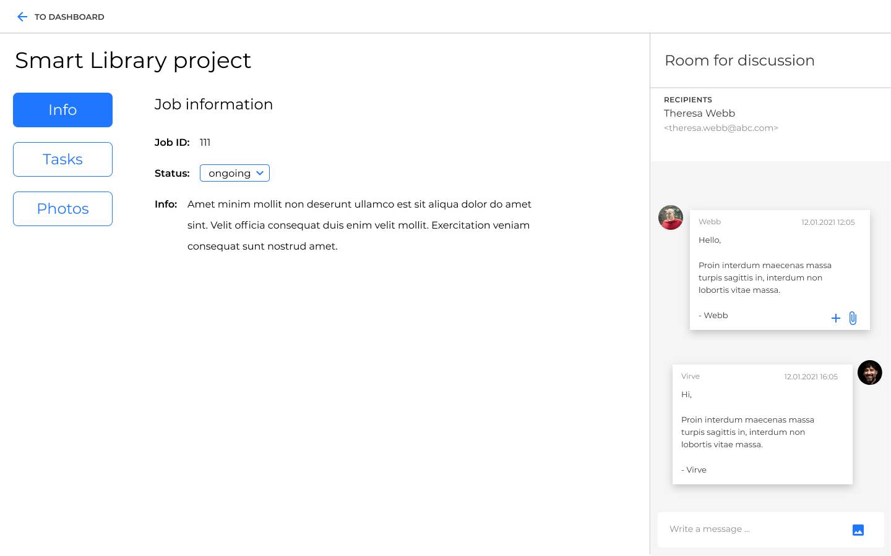
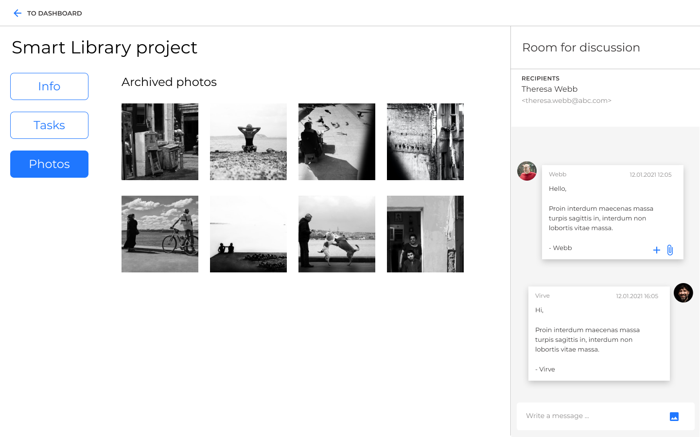

# Web challenge

This project was bootstrapped with [Create React App](https://github.com/facebook/create-react-app).

## Work logs

- 10 hours

## Start project

In the project directory, you can run:

`npm start`

Runs the app in the development mode.\
Open [http://localhost:3000](http://localhost:3000) to view it in the browser.

The page will reload if you make edits.\
You will also see any lint errors in the console.

## Re-design for slide 4

